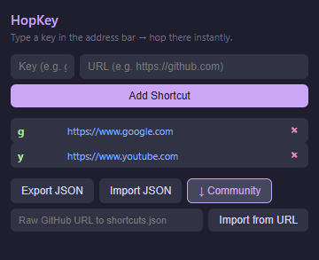

# HopKey

Type a key in Chrome's address bar and hop to any site instantly.

For example, type `g` and press Enter → Google. Type `gh` → GitHub. You define the keys.

---

## Chrome Extension

### Install

1. Download or clone this repository.
2. Open Chrome and go to `chrome://extensions/`
3. Enable **Developer mode** (top-right toggle).
4. Click **Load unpacked** and select the `extension/` folder.
5. The HopKey icon will appear in your toolbar.

### Use



- Click the HopKey icon to open the popup.
- **Add a shortcut:** type a key (e.g. `gh`) and a URL (e.g. `https://github.com`), click **Add Shortcut**.
- **Delete a shortcut:** click `×` next to any row.
- **↓ Community:** import the community shortcut list from this repo with one click.
- **Export JSON / Import JSON:** backup or restore your shortcuts.
- **Import from URL:** paste any raw GitHub URL to a `shortcuts.json` file.

---

## Community shortcuts.json

The `shortcuts.json` file at the root of this repo is a shared community list.
Anyone can open a Pull Request to add useful shortcuts.

Import URL:
```
https://raw.githubusercontent.com/alperugurca/HopKey/refs/heads/main/shortcuts.json
```

### Format

```json
{
    "g":  "https://www.google.com",
    "y":  "https://www.youtube.com",
    "gh": "https://www.github.com"
}
```

Rules:
- Keys must be **lowercase**, short, and memorable.
- Values must be **full URLs** starting with `https://` or `http://`.
- No personal or private URLs.
- One shortcut per line for clean diffs.

### Contribute

1. Fork the repository.
2. Edit `shortcuts.json` — add your shortcut in alphabetical order.
3. Open a Pull Request with a short description.

---

## License

MIT
